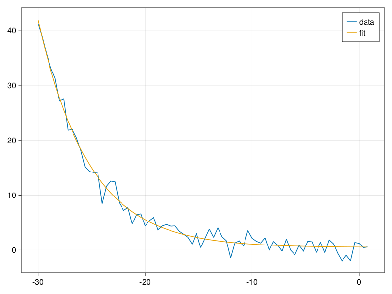

# Models.jl Documentation

This simple package contains functions and lineshapes
commonly used in vibrational polariton spectroscopic experiments.
The main purpose is code reusability for my own projects, but
on the off chance that it is useful to others, it is available.
These functions are best used together with [Optim.jl](https://github.com/JuliaNLSolvers/Optim.jl) or the global optimization package [Optimization.jl](https://optimization.sciml.ai/stable/) for
fitting. It would be nice if models and fitting procedures were bundled together in the future,
like the [lmfit](https://lmfit.github.io/lmfit-py/index.html) package available for Python (leveraging SciPy).

The `squared_errors()` function is useful for use with `Optim.jl` for
curve fitting. It can be implemented for a set of x- and y-data and 
a model, e.g. an exponential curve. (Makie.jl is not a dependency; we only use it to demonstrate the fit.)

```
using Optim
using Models
using GLMakie

xdata = -30:0.4:1.0

A, τ, y_0 = [0.1, 5.0, 0.3]
ydata = exponential(xdata, [A, τ, y_0]) .+ 1.2 * randn(length(xdata))

p0 = [0.1, 1.0, 0.0]
result = optimize(b -> squared_errors(b, exponential, xdata, ydata), p0)
params = Optim.minimizer(result)

fig = Figure()
display(fig)
ax = Axis(fig[1, 1])
lines!(ax, xdata, ydata, label = "data")
lines!(ax, xdata, exponential(xdata, params), label = "fit")
axislegend(ax)
```




## General Functions

Common functions and lineshapes for spectroscopy.


```@autodocs
Modules = [Models]
Pages = ["functions.jl"]
```


## Special Functions

These function are specific to cavity polariton research,
where things like the cavity transmittance, material dielectric function,
and cavity free spectral range (FSR) need to be calculated and modeled.

```@autodocs
Modules = [Models]
Pages = ["special_functions.jl"]
```